# IEC60870 101/104 Protocol Test Analyzer

Free alternative for IEC 60870-5-104 and IEC 60870-5-101 FAT/SAT testing, built for practical SCADA commissioning work.
This repository is release-only and provides public-facing documentation plus binary download links.

## Why This Tool Exists

Commercial protocol analyzers are useful, but in many projects they are expensive, limited in availability, or not focused on the exact pain points faced during FAT, SAT, and point-to-point commissioning.

This tool is designed to help SCADA engineers, substation engineers, and integrators work faster when validating:

- IOA to point mapping
- value and quality consistency
- SOE timestamp behavior
- command execution and command mismatch
- data priority behavior under traffic burst
- protocol reliability findings that should be corrected before operation

## What Makes It Different

- Human-readable line monitor instead of raw packet-only inspection
- Last known value viewer with IOA, value, quality, COT, class, context, and timestamp in one place
- Internal event and status history panels for FAT/SAT evidence and troubleshooting
- Findings panel that explains what may be wrong and what should be improved
- Built-in command testing workflow for GI, time sync, single command, double command, and setpoint command
- Capture and replay workflow for investigation and reporting
- Small utility features such as IOA structured converter that help real field work

## Flagship Screenshots

### Human-Readable Protocol Flow

### Last Known Value Cross-Check

### Findings and Reliability Insight

### Status and Session Audit Trail

### Command Testing Workflow

## Supporting Screenshots

### Connection Setup

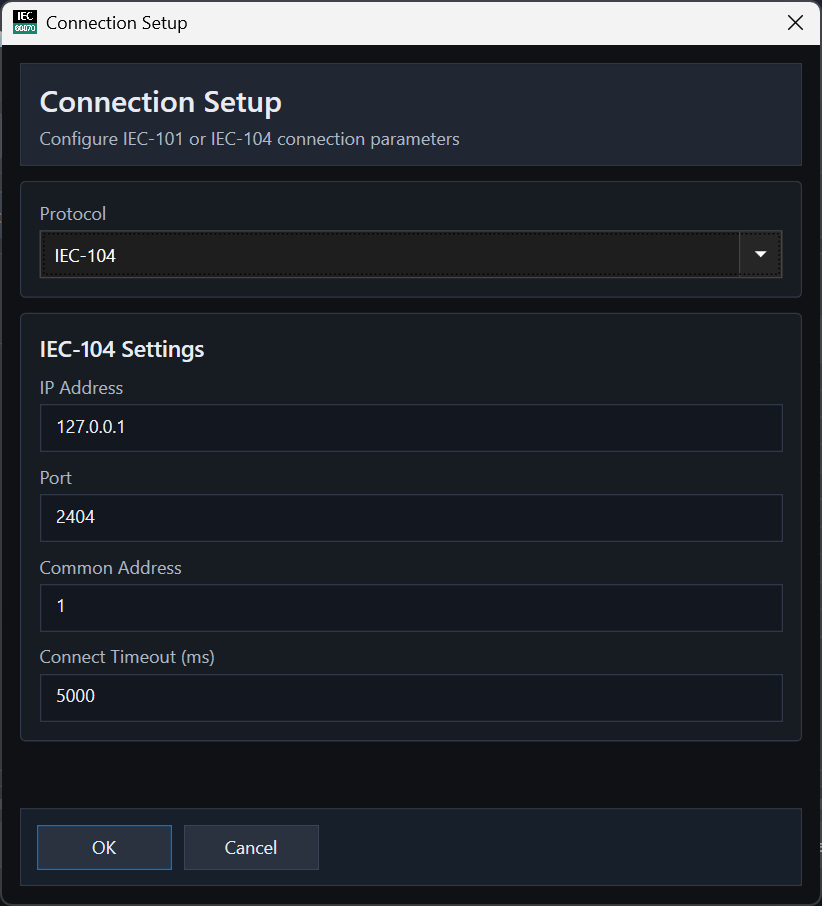
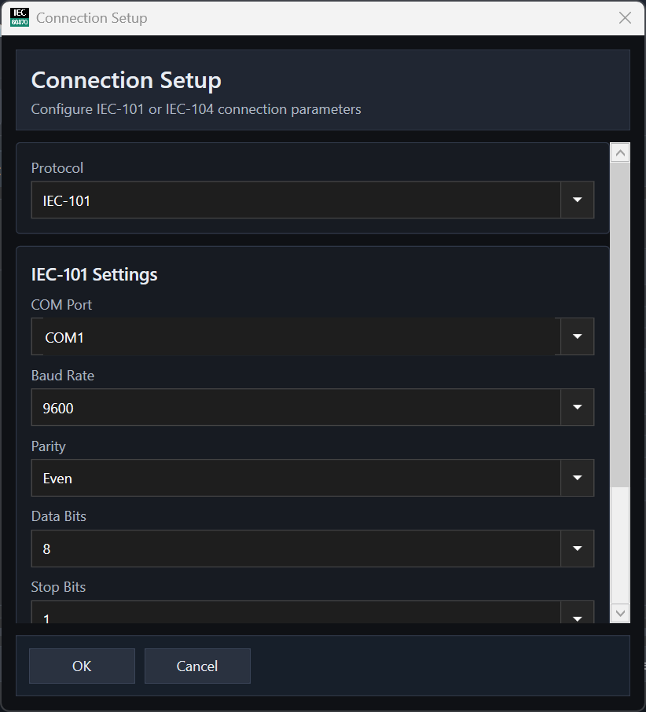

### Monitoring and Analysis Panels

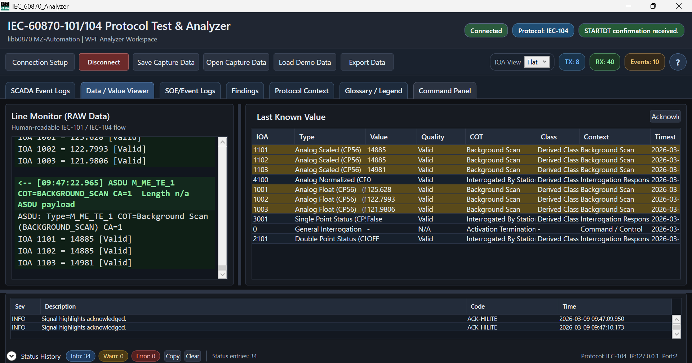
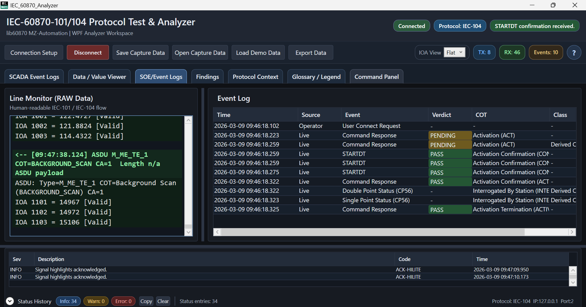
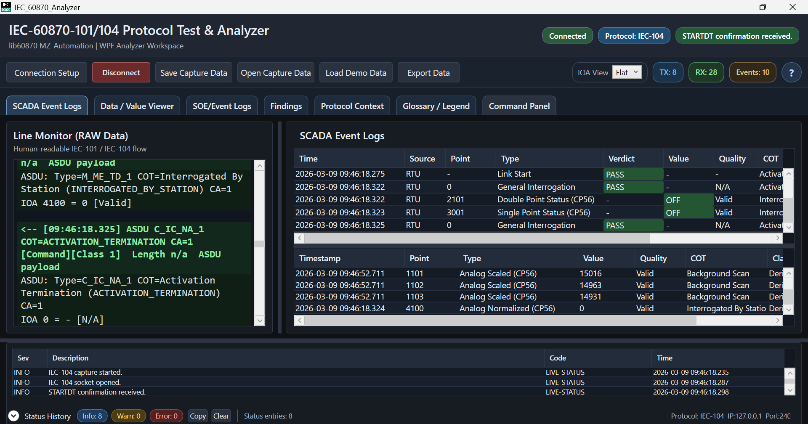
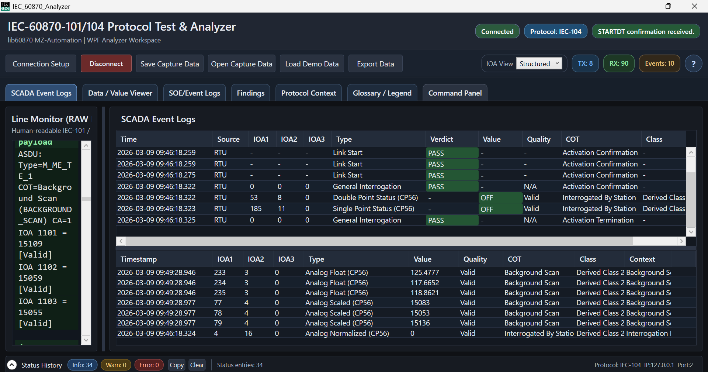
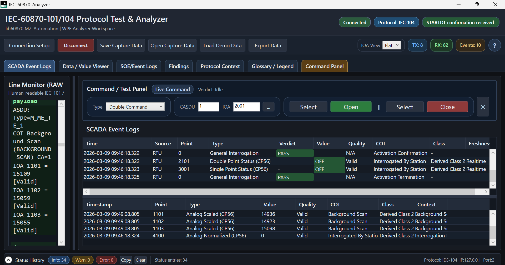

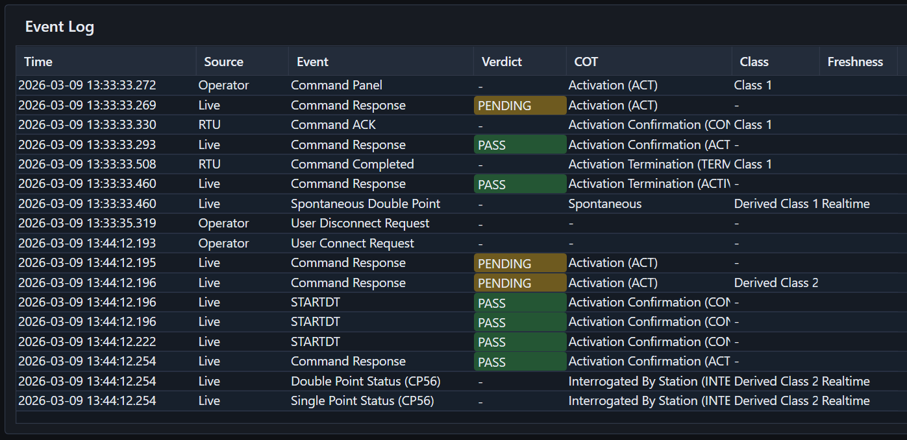
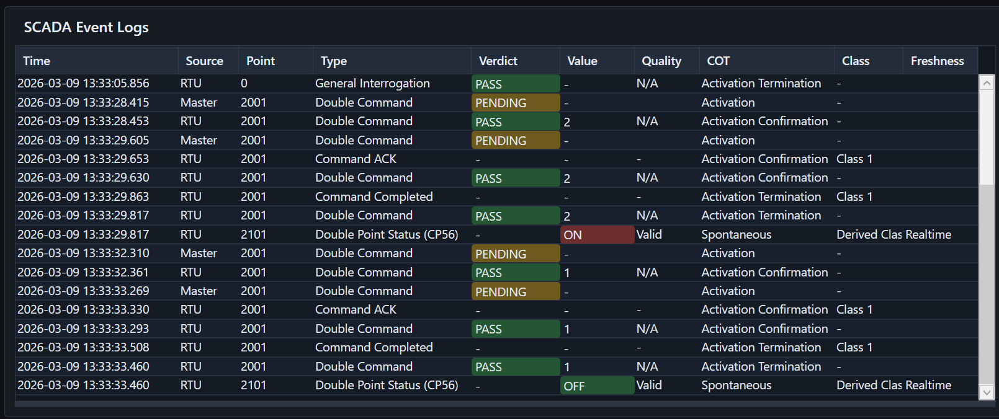
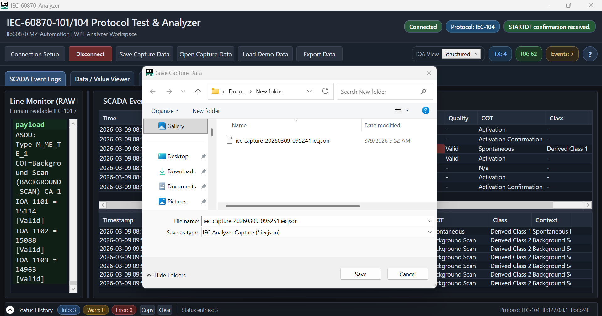
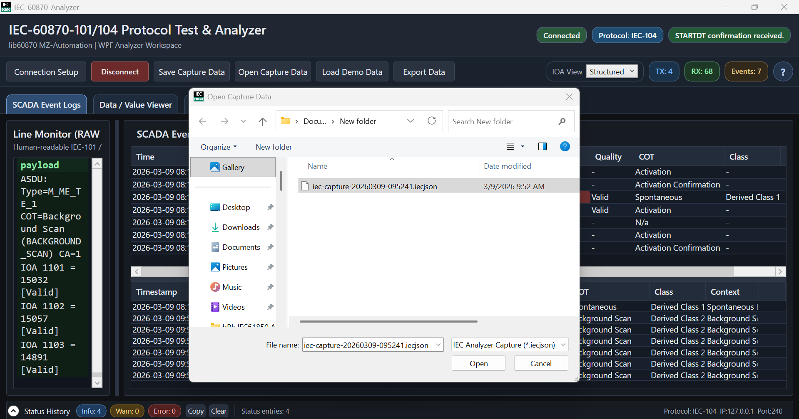

### Reference and Utility Views

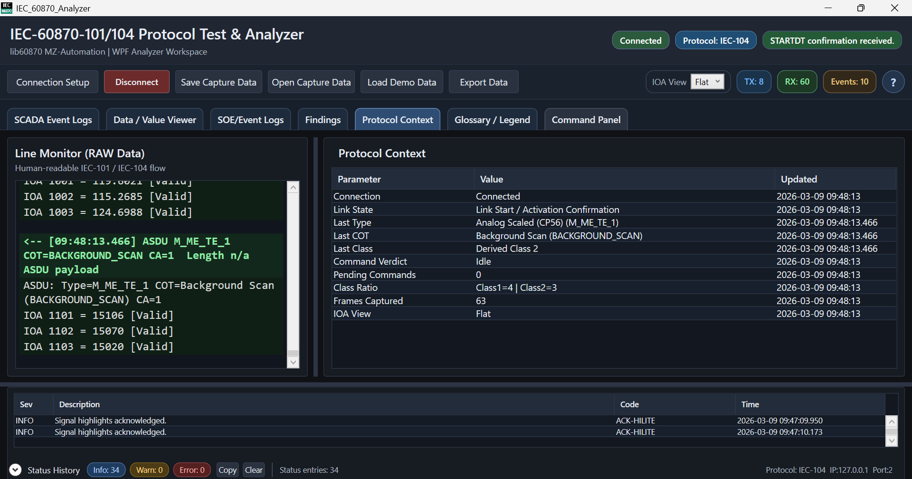
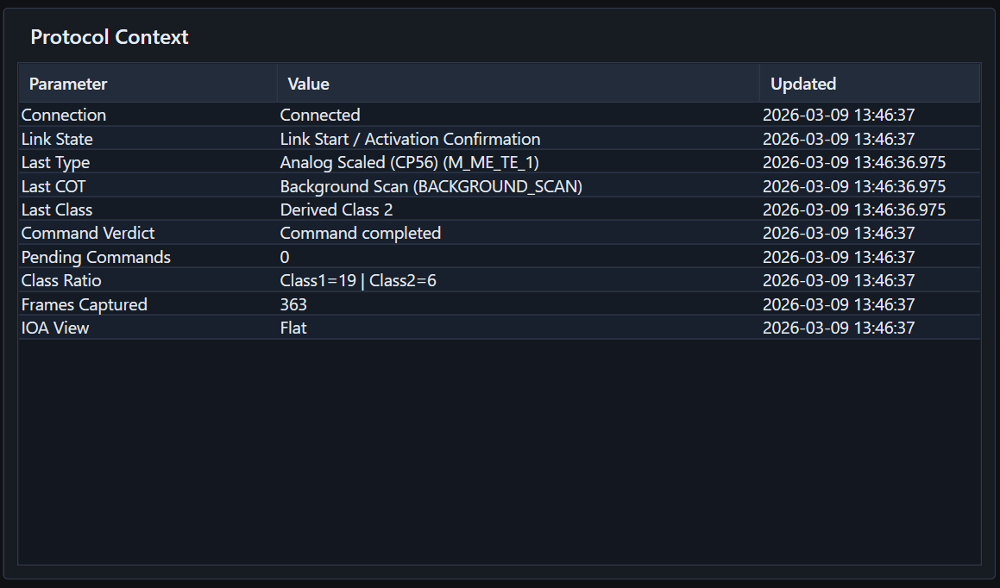
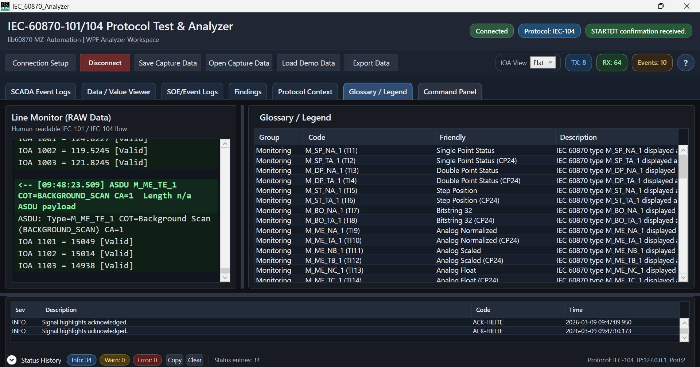
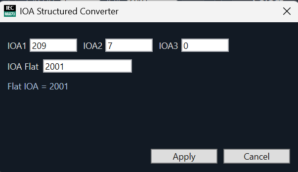

## Real Field Use Cases

### Command mismatch analysis

Useful when command execution fails because of:

- wrong IOA mapping
- wrong command type assignment
- direct operate versus SBO mismatch
- unexpected activation or confirmation behavior

This helps identify why a command is sent but not executed correctly.

### Class 1 and Class 2 mismatch analysis

Useful when communication becomes unstable because:

- measurement data is assigned to the wrong class
- traffic burst overwhelms expected command responsiveness
- priority behavior does not match the intended SCADA design

This helps verify that command traffic still works in the worst communication condition.

### Type identification and value interpretation check

Useful when point data is present but wrong because of:

- incorrect Type ID mapping
- inconsistent value scaling or interpretation
- invalid quality behavior
- SOE timestamp mismatch between systems

This helps speed up FAT and SAT troubleshooting.

## Typical Workflow

1. Download the latest binary package from Releases.
2. Run the analyzer and connect using IEC-104 or IEC-101 settings.
3. Monitor values, event logs, command behavior, and status history.
4. Review Findings for issues that should be corrected.
5. Save capture files for replay, evidence, and reporting.

## User Docs

- [Quick Start](docs/Quick-Start.md)
- [Release Notes Template](docs/Release-Notes-Template.md)
- [Package Structure](docs/Package-Structure.md)
- [Release Guide](docs/Release-Guide.md)

## Download

- [Latest Release](https://github.com/masarray/IEC60870_101_104_ProtocolTestAnalyzer/releases/latest)
- Recommended package format: `IEC60870-Protocol-Test-Analyzer-vX.Y.Z-win-x64.zip`

## Repository Layout

- `assets/images` : screenshots used by the public README and docs
- `docs` : public user-facing notes and quick help
- `package` : optional local staging folder for release zip contents before publishing

## Notes

- This repository does not contain the private development source code.
- Release binaries should be distributed through GitHub Releases, not committed repeatedly into the repository history.
