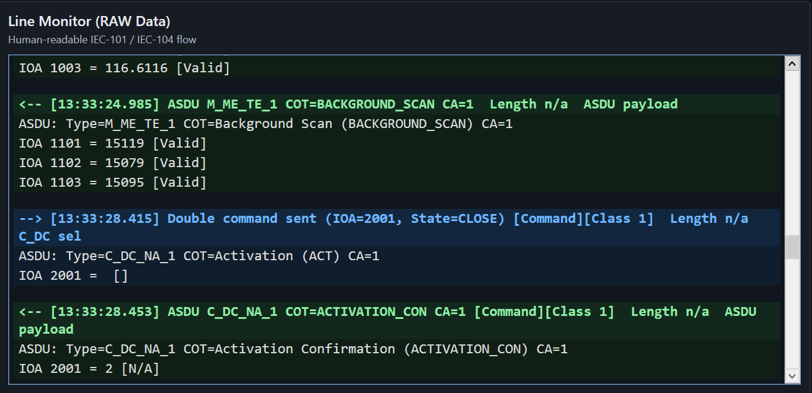
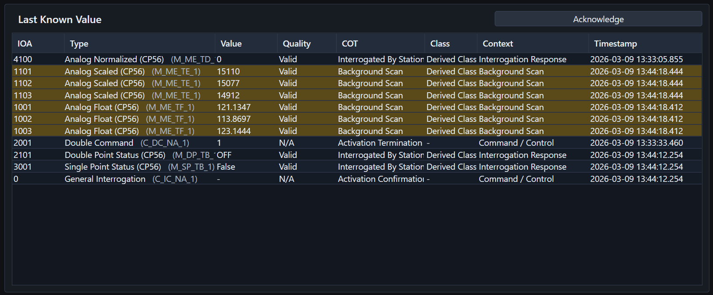
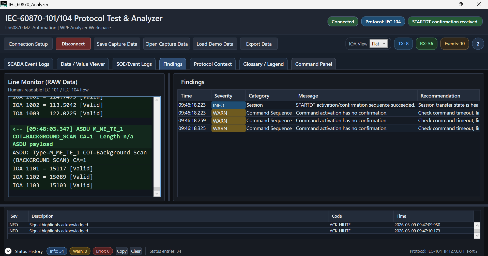
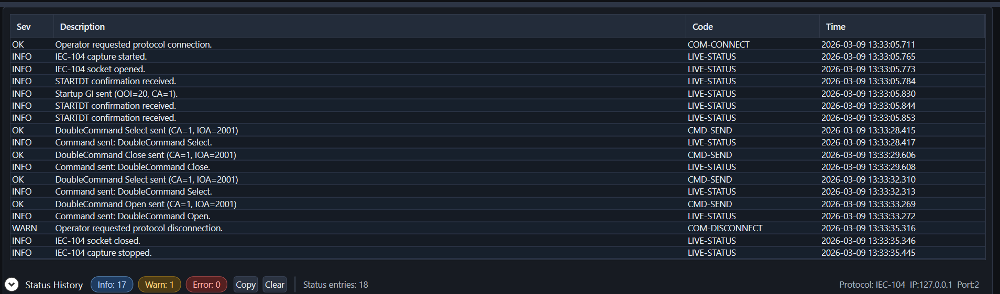
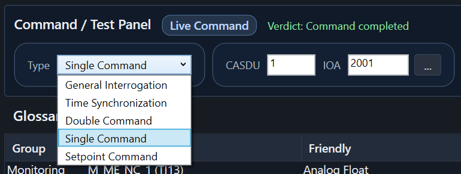
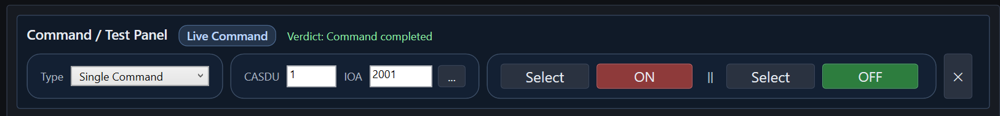
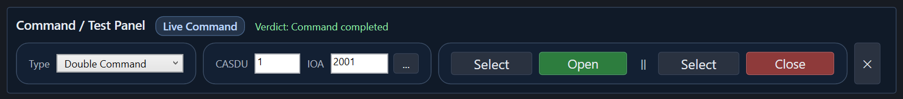
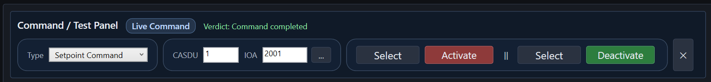
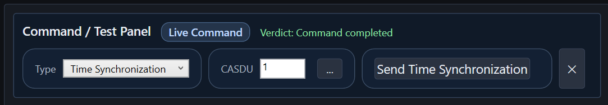
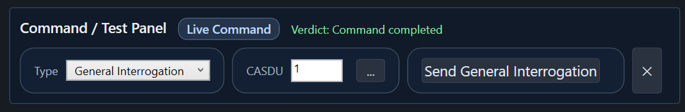

# IEC60870 101/104 Protocol Test Analyzer

An internally developed diagnostic support platform for improving IEC-101 and IEC-104 verification workflow during FAT, SAT, commissioning, troubleshooting, and product readiness activities.

This repository is release-only and provides public-facing documentation plus binary download links.

## Why This Tool Exists

IEC-101 and IEC-104 verification often requires engineers to manually correlate gateway settings, point mapping, command behavior, event flow, and master SCADA response. In practice, this can create repeated troubleshooting loops, additional engineering effort, and dependency on individual experience.

This tool was developed to support a more transparent and repeatable workflow by providing:

- clearer visibility of protocol behavior
- faster root cause identification
- stronger technical evidence for FAT, SAT, and troubleshooting discussion
- more consistent validation of point mapping, command behavior, and data priority handling
- additional readiness support for homologation or certification activities

## What It Enables

- IEC-101 and IEC-104 verification workflow support
- Human-readable protocol flow analysis
- Faster cross-check of IOA, value, quality, COT, class, context, and timestamp
- Earlier detection of data class, IOA mapping, and command behavior issues
- Better FAT/SAT evidence through event logs, status history, and capture replay
- Automatic findings that reduce dependence on individual interpretation
- Practical readiness support for SICAM A8000 and SICAM S8000 before PLN Pusertif homologation or certification activities

## Main Engineering Value

This platform supports practical process improvement in the following areas:

- FAT and SAT acceleration through faster troubleshooting cycles
- potential reduction of repeated point-to-point rework
- engineering hour savings through better visibility and evidence correlation
- schedule delay avoidance through earlier detection of communication issues
- improved handover quality through clearer validation records
- stronger standardization and knowledge transfer across projects

## Flagship Screenshots

### Human-Readable Protocol Flow

### Last Known Value Cross-Check

### Findings and Reliability Insight

### Status and Session Audit Trail

### Command Testing Workflow

## Main Use Cases

### Data class and priority validation

Use the platform to identify whether event and measurement traffic are grouped correctly and whether high-priority data behavior remains aligned with expected SCADA traffic handling.

### IOA mapping validation

Use the platform to detect mapping mismatches such as swapped IOA structures, incorrect point assignment, or inconsistency between gateway engineering data and master SCADA expectations.

### Command behavior validation

Use the platform to analyze:

- Direct Operate versus Select Before Operate behavior
- activation, confirmation, and termination sequence consistency
- unexpected command response behavior

### Technical evidence for FAT/SAT and troubleshooting

Use event logs, status history, line monitor, and capture replay to support technical clarification and improve alignment during testing and troubleshooting.

### Certification readiness support

Use the platform to support product readiness for homologation or certification activities, especially where Data Class and ACD behavior must be demonstrated clearly.

## User Docs

- [Quick Start](docs/Quick-Start.md)
- [User Manual](docs/User-Manual.md)
- [Release Notes Template](docs/Release-Notes-Template.md)
- [Package Structure](docs/Package-Structure.md)
- [Release Guide](docs/Release-Guide.md)

## Download

- [Latest Release](https://github.com/masarray/IEC60870_101_104_ProtocolTestAnalyzer/releases/latest)
- Recommended package format: `IEC60870-Protocol-Test-Analyzer-vX.Y.Z-win-x64.zip`

## Notes

- This repository does not contain the private development source code.
- Release binaries should be distributed through GitHub Releases, not committed repeatedly into repository history.
